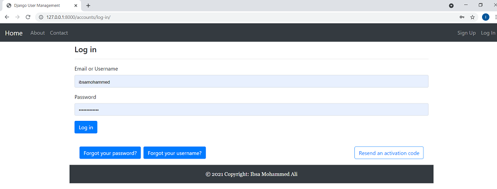
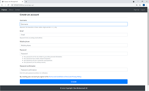
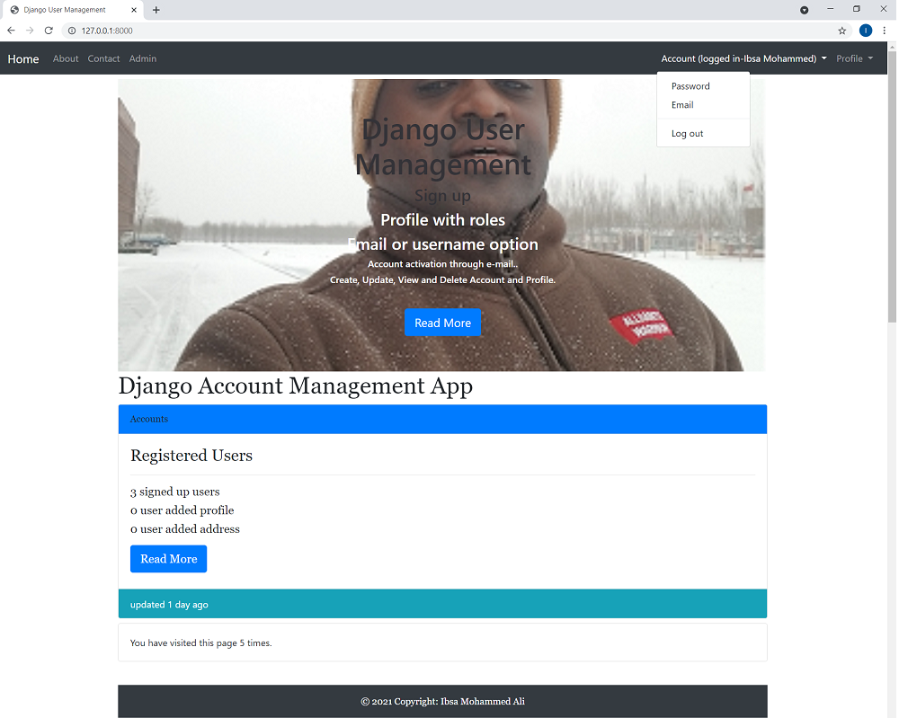
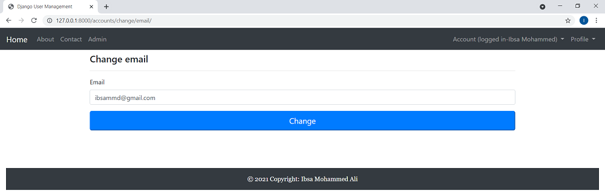
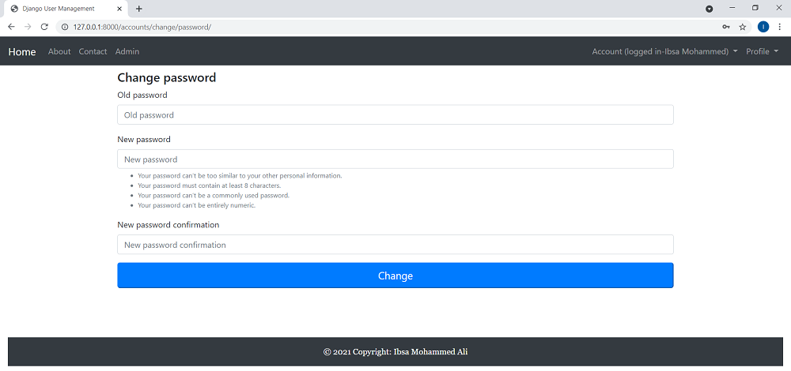
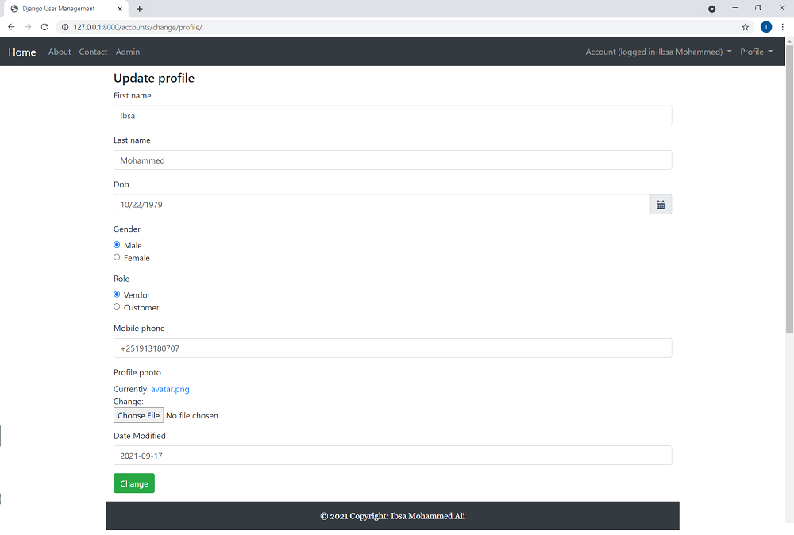
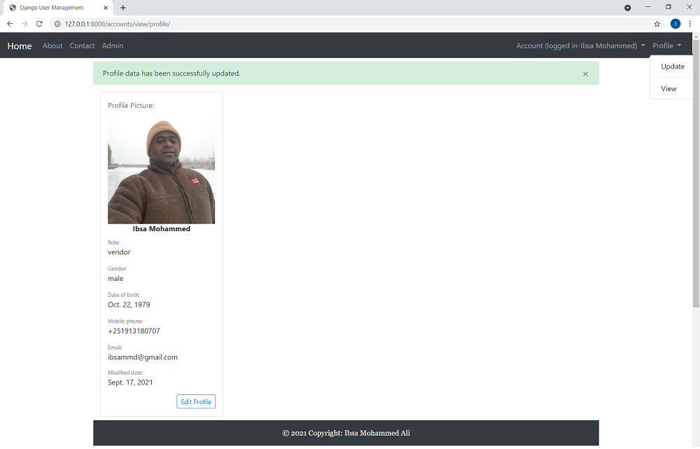
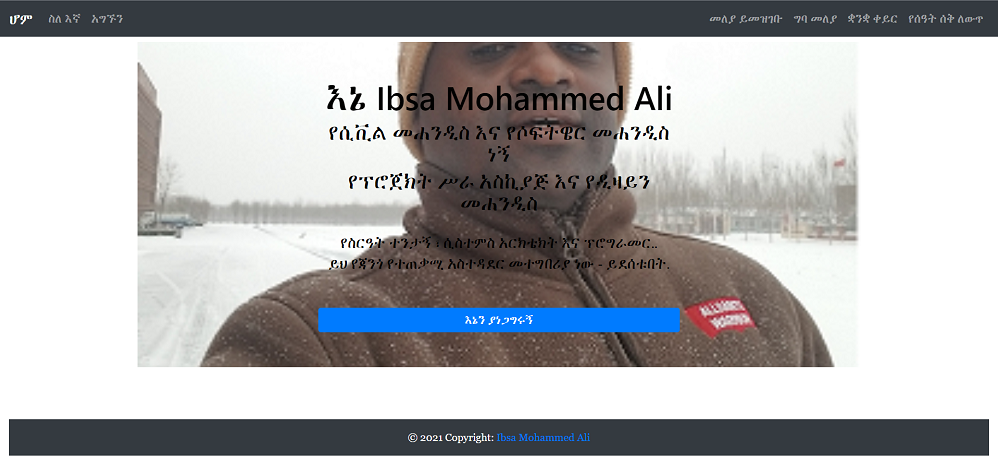

# A Django user management.

Custom user management.

## Screenshots

|     Home    |       Log In      |       Sign Up          |
| ------------|-------------------|------------------------|
|  |  |  |


|      Log In  |    change email   |     Password change     |
| -------------|-------------------|-------------------------|
|  |  |  |


|            Profile update        |       Profile view     |      Language view      |
| ---------------------------------|------------------------|------------------------|
|  |  |  

## Functionality

- Log in
    - via username & password
    - via email & password
    - via email or username & password
    - with a remember me checkbox (optional)
- Create an account
- Log out
- Profile activation via email
- Reset password
- Remind a username
- Resend an activation code
- Change password
- Change email
- Change profile
- Multilingual: English, Amharic, Afaan Oromoo, Simplified Chinese

### Clone the project

```
git clone https://github.com/aliibsamohammed/customuser_management
cd customuser_management
```

### Install dependencies & activate virtualenv

```
pip install pipenv

pipenv install
pipenv shell
```

### Configure the settings (connection to the database, connection to an SMTP server, and other options)

1. Edit `customuser_project/settings.py` if you want to develop the project.


### Apply migrations

```
python customuser_project/manage.py migrate
```

### Collect static files (only on a production server)

```
python customuser_project/manage.py collectstatic
```

### Running

#### A development server

Just run this command:

```
python customuser_project/manage.py runserver
```